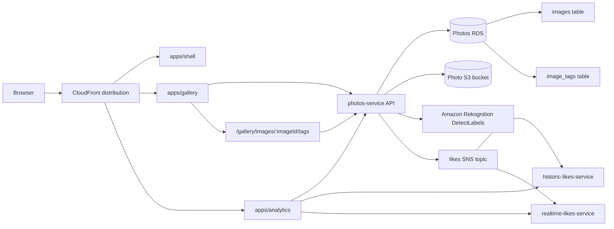

# AWS 10 - Rekognition Tagging

This version builds on the AWS 09 microfrontend architecture and adds image tagging to the photos domain. Users can manually maintain tags for photos, search gallery results by saved tags, and ask Amazon Rekognition for suggested tags before choosing what to persist.

The microservice ownership, owner-local CDK folders, realtime likes service, and shell/gallery/analytics frontend split are already present before this version. AWS 10 is focused on the tagging capability.



## What this version adds

- An `image_tags` table owned by `services/photos-service`.
- Photo responses that include saved tags.
- Gallery search that can match saved tags.
- A gallery tag editing route at `/gallery/images/:imageId/tags`.
- An authenticated endpoint to save manual tags.
- An authenticated endpoint to request Rekognition tag suggestions.
- A fixture mode for deterministic tag suggestions during development or demos.

Everything else in the architecture is inherited from the earlier reworked versions:

- AWS 07 introduced full service ownership and owner-local CDK.
- AWS 08 added realtime likes.
- AWS 09 split the frontend into shell, gallery, and analytics route apps.

## Tagging flow

1. A user opens a photo in the gallery.
2. The gallery app links to the tag editing route.
3. The tag route loads the photo through `@frontend/api-client`.
4. The user can add, remove, or replace manual tags.
5. The gallery app sends the saved tag set to the photos service.
6. The photos service replaces the rows for that image in `image_tags`.
7. Future gallery and analytics photo reads include the saved tags.

Rekognition suggestions are separate from persistence:

1. The user requests suggestions.
2. The gallery app calls `POST /auth/photos/:imageId/tag-suggestions`.
3. The photos service loads the S3 object location for the image.
4. The photos service calls Rekognition `DetectLabels`.
5. Suggested labels are returned to the browser.
6. Nothing is saved until the user updates the tag set.

That separation keeps Rekognition as an assistant rather than an automatic writer.

## Photos service changes

The photos service owns the new table:

```sql
CREATE TABLE image_tags (
  image_id INTEGER NOT NULL REFERENCES images(id) ON DELETE CASCADE,
  tag TEXT NOT NULL,
  created_at TIMESTAMP NOT NULL DEFAULT NOW(),
  PRIMARY KEY (image_id, tag)
);
```

The main authenticated routes are:

```text
GET  /auth/photos/gallery
PUT  /auth/photos/:imageId/tags
POST /auth/photos/:imageId/tag-suggestions
```

The public gallery endpoint still exists:

```text
GET /public/gallery-photos
```

Only authenticated users can update tags or ask for tag suggestions.

## Rekognition suggestions

The suggestion response has this shape:

```json
{
  "imageId": "123",
  "tags": ["beach", "water", "outdoors"],
  "source": "rekognition"
}
```

For deterministic local or workshop runs, set:

```bash
PHOTOS_TAG_SUGGESTION_MODE=fixture
```

In fixture mode, the photos service returns predictable suggestions instead of calling Rekognition.

## Frontend ownership

The route apps remain the same as AWS 09:

```text
apps/shell
  /
  /profile
  /auth/callback

apps/gallery
  /gallery
  /gallery/upload
  /gallery/images/:imageId/tags

apps/analytics
  /analytics
  /analytics/images/:imageId
```

Tag editing belongs to gallery because it is part of photo management. Analytics reads the enriched photo shape through the shared API client but does not own tag editing.

Shared frontend packages remain under:

```text
packages/frontend/api-client
packages/frontend/auth
packages/frontend/tailwind-config
packages/frontend/tokens
packages/frontend/ui
```

Backend event contracts remain under:

```text
packages/backend/events
```

## Local workflow

Install dependencies from the monorepo folder:

```bash
cd monorepo
pnpm install
```

Bring up the local support services:

```bash
pnpm run bootstrap-up
```

Deploy or update the backend, then generate frontend environment files:

```bash
pnpm run deploy-everything
pnpm run generate-env
```

Run all route apps locally:

```bash
pnpm run dev
```

The shell proxies route apps during local development:

```text
http://localhost:5173
http://localhost:5173/gallery
http://localhost:5173/analytics
```

Run checks:

```bash
pnpm run type-check
pnpm run build
```

## Deployment

Deploy everything:

```bash
cd monorepo
pnpm run deploy-everything
pnpm run generate-env
```

Deploy the photos service after backend tagging changes:

```bash
pnpm run photos-service:deploy
```

Deploy the gallery after tag UI changes:

```bash
pnpm run gallery:deploy
```

Deploy frontend apps independently:

```bash
pnpm run shell:deploy
pnpm run gallery:deploy
pnpm run analytics:deploy
```

Destroy everything:

```bash
pnpm run destroy-everything
```

## Data and simulation

Use the existing data commands:

```bash
pnpm run data:reset
pnpm run data:seed
pnpm run simulator:start
```

Photo loading still belongs to the photos service. By default the seed script reads the shared repository-level `photos-to-upload` folder; override with `PHOTOS_DIR` when needed.

## Repository shape

```text
monorepo/
  apps/
    shell/
      cdk/
      src/
    gallery/
      src/
    analytics/
      src/
  packages/
    backend/
      events/
    frontend/
      api-client/
      auth/
      tailwind-config/
      tokens/
      ui/
  scripts/
  services/
    cognito-service/
      cdk/
    photos-service/
      cdk/
      src/
      scripts/
    historic-likes-service/
      cdk/
    realtime-likes-service/
      cdk/
```

## Source material folded into this version

This reworked AWS 10 draws on the old AWS 11 Rekognition tagging work. The microfrontend architecture and layout improvements have already been pulled back into AWS 09, so this version is now cleanly scoped to the domain change: persistent image tags, gallery tag editing, tag-aware search, and Rekognition-powered suggestions.
