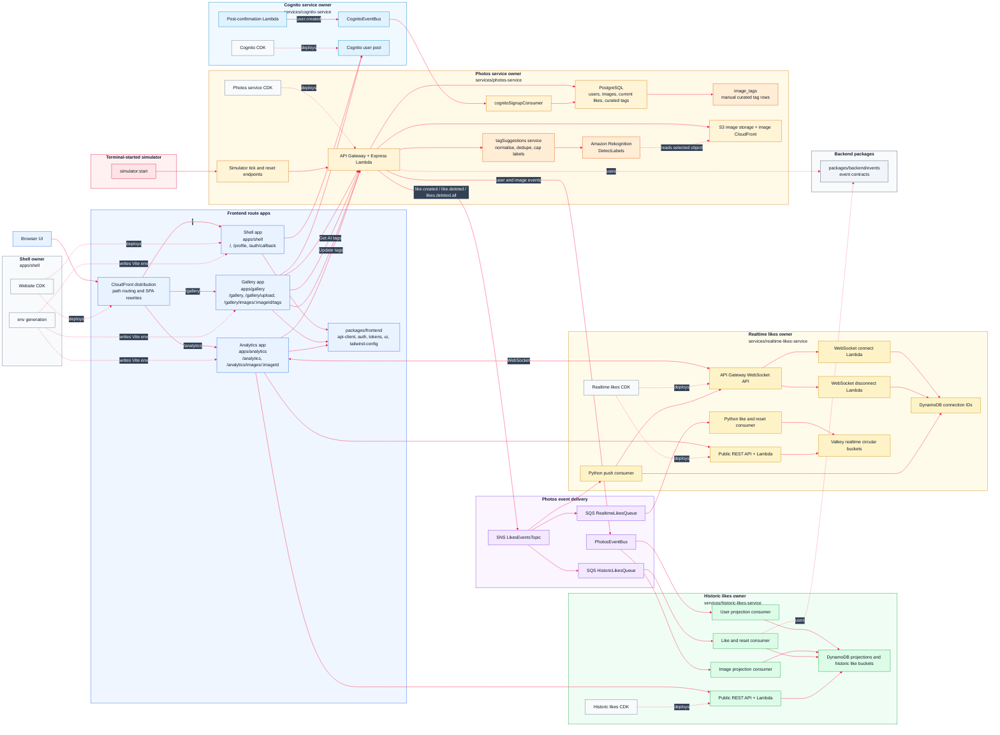

# AWS 10 - Rekognition Tagging

This reworked version builds on AWS 09's independently deployable backend microservices and microfrontend route apps, then adds curated image tagging to the photos domain. Users can manually maintain tags for photos, search the gallery by saved tags, and ask Amazon Rekognition for suggested tags before choosing what to persist.

The architectural baseline from the previous reworked sections stays in place: every service owns its runtime code, operational scripts, and CDK infrastructure. The former course `core-service` has been repatriated into `photos-service`, so photos, users, current likes, image storage, seed data, simulator endpoints, outbound photos events, persistent tags, and Rekognition suggestions all live under `services/photos-service`.

## Architecture



## What This Version Teaches

This version combines the realtime likes architecture from AWS 08, the microfrontend route-app split from AWS 09, and the useful tagging work from the old AWS 11 Rekognition sequence:

- persistent curated image tags in the photos service database
- gallery and single-image reads that include saved `tags`
- tag-aware gallery search across title, description, author nickname, and tag text
- a gallery-owned tagging route at `/gallery/images/:imageId/tags`
- authenticated tag replacement through the photos service
- Rekognition `DetectLabels` suggestions through the photos service Lambda
- deterministic fixture suggestions for local development and demos
- a clear separation between AI suggestions and persisted curated tags
- shared browser API client types for tag reads, tag updates, and tag suggestions
- continued SNS fan-out from the photos service `LikesEventsTopic` to historic and realtime consumers
- continued EventBridge projection streams for users and images
- independent route-app deployment for shell, gallery, and analytics

AWS 10 deliberately keeps tagging inside the photos domain. Tags describe photos, tag search is part of the gallery catalogue, and Rekognition needs access to the photos service image bucket. Historic and realtime likes services continue to consume like events; they do not own image tagging.

## Deployable Owners

| Owner | Path | Owns |
| --- | --- | --- |
| Shell app | `monorepo/apps/shell` | Root route, navigation, profile, auth callback, website hosting CDK, env generation, CloudFront distribution, S3 website bucket |
| Gallery app | `monorepo/apps/gallery` | `/gallery`, `/gallery/upload`, photo browsing, search, preview, upload, current like actions, and `/gallery/images/:imageId/tags` |
| Analytics app | `monorepo/apps/analytics` | `/analytics`, `/analytics/images/:imageId`, historic charts, realtime charts, tables, and WebSocket refresh handling |
| Cognito service | `monorepo/services/cognito-service` | Cognito user pool, hosted UI domain, app client, post-confirmation Lambda, Cognito event bus, Cognito reset |
| Photos service | `monorepo/services/photos-service` | Express API, RDS, S3, image CloudFront distribution, image tags, Rekognition suggestions, photos event bus, SNS likes topic, Cognito signup ingest, seed, simulator, API tests |
| Historic likes service | `monorepo/services/historic-likes-service` | DynamoDB projections, historic like aggregates, SQS consumers, public historic likes API, historic reset and API tests |
| Realtime likes service | `monorepo/services/realtime-likes-service` | Python Lambdas, Valkey buckets, realtime SQS consumer, SNS push consumer, REST API, WebSocket API, connection storage, public API tests |
| Shared frontend packages | `monorepo/packages/frontend/*` | Browser API client, auth helpers, design tokens, Tailwind config, shared UI styles and components |
| Shared backend events | `monorepo/packages/backend/events` | Cross-service event source, detail type, and payload contracts |

Every deployable owner has its own CDK folder where it owns infrastructure:

```text
monorepo/apps/shell/cdk
monorepo/services/cognito-service/cdk
monorepo/services/photos-service/cdk
monorepo/services/historic-likes-service/cdk
monorepo/services/realtime-likes-service/cdk
```

There is no central root CDK app.

## Tagging Flow

Curated tag persistence and AI suggestions intentionally follow different paths.

Manual tag editing:

```text
Browser
  -> gallery app /gallery/images/:imageId/tags
    -> GET photo data through @frontend/api-client
      -> photos-service
        -> PostgreSQL images + image_tags

Browser
  -> Update tags
    -> PUT /auth/photos/:imageId/tags
      -> photos-service
        -> replace rows in PostgreSQL image_tags
```

Rekognition suggestions:

```text
Browser
  -> Get AI tags
    -> POST /auth/photos/:imageId/tag-suggestions
      -> photos-service
        -> load image bucket and object key
        -> Amazon Rekognition DetectLabels
        -> normalise, lower-case, dedupe, and cap labels
      -> browser editable token list
```

Rekognition output is not saved automatically. Suggested labels are merged into the browser's editable token list, and the user can remove unwanted tags before clicking **Update tags**. That keeps Rekognition as an assistant rather than an automatic writer.

## Data Ownership

**Photos service Postgres tables**

```text
registered_user
images
image_likes
image_tags
```

Postgres is the source of truth for users known to the app, uploaded image metadata, current like state, and curated photo tags.

`image_likes` stores the current relationship between a user and a photo:

```sql
CREATE TABLE IF NOT EXISTS image_likes (
    user_sub VARCHAR(255) NOT NULL,
    image_id INT NOT NULL,
    created_at TIMESTAMP DEFAULT CURRENT_TIMESTAMP,
    PRIMARY KEY (user_sub, image_id)
);
```

`image_tags` stores one curated tag per image/tag pair:

```sql
CREATE TABLE image_tags (
  image_id INTEGER NOT NULL REFERENCES images(id) ON DELETE CASCADE,
  tag TEXT NOT NULL,
  created_at TIMESTAMP NOT NULL DEFAULT NOW(),
  PRIMARY KEY (image_id, tag),
  CONSTRAINT image_tags_tag_not_blank CHECK (LENGTH(TRIM(tag)) > 0)
);

CREATE INDEX idx_image_tags_tag ON image_tags (LOWER(tag));
```

Tag updates replace the saved set for an image. The request body is validated with Zod, and tags are trimmed, lowercased, deduplicated, length-limited, and capped before storage.

**Historic likes DynamoDB tables**

```text
UsersProjectionTable
ImagesProjectionTable
HistoricPhotoBucketLikes
HistoricAuthorBucketLikes
```

The projection tables hold the latest user and image read models. The aggregate tables hold sparse historic like buckets for images and authors.

**Realtime likes storage**

```text
Valkey realtime buckets
DynamoDB WebSocket connection table
```

Valkey holds recent image and author like buckets. DynamoDB stores active WebSocket connection IDs so the push consumer can notify connected analytics browsers.

## Service APIs

### Photos Service

The photos service is an Express app adapted to Lambda with `@codegenie/serverless-express`.

Public routes:

```text
GET    /public/health
GET    /public/gallery-photos
GET    /public/images/:imageId
POST   /public/simulation/tick
DELETE /public/simulation/likes
```

Authenticated routes:

```text
GET    /auth/photos/gallery
POST   /auth/photos/presigned-url
POST   /auth/photos/:imageId/like
PUT    /auth/photos/:imageId/tags
POST   /auth/photos/:imageId/tag-suggestions
GET    /auth/users/me
PUT    /auth/users/me/nickname
GET    /auth/admin/member
DELETE /auth/admin/photos
```

Anonymous users use `GET /public/gallery-photos`. Signed-in users use `GET /auth/photos/gallery`, which adds `likedByCurrentUser` to each photo where appropriate. Both gallery reads include saved `tags`.

Toggling a like uses:

```text
POST /auth/photos/{imageId}/like
```

It returns the new current state:

```json
{
  "liked": true
}
```

Updating curated tags uses:

```text
PUT /auth/photos/:imageId/tags
```

with:

```json
{
  "tags": ["beach", "water", "outdoors"]
}
```

The response contains the saved tag set:

```json
{
  "tags": ["beach", "outdoors", "water"]
}
```

Requesting suggestions uses:

```text
POST /auth/photos/:imageId/tag-suggestions
```

The response shape is:

```json
{
  "imageId": "123",
  "tags": ["beach", "water", "outdoors"],
  "source": "rekognition"
}
```

`source` is `fixture` when local fixture mode is enabled.

### Historic Likes Service

The historic likes service has small direct Lambda handlers behind API Gateway.

Public routes:

```text
GET /public/health
GET /public/photo-likes?imageId=<image-id>
GET /public/author-likes?userId=<author-user-id>
GET /public/historic-likes
```

With an ID, each endpoint returns chart data for one photo or one author. Missing buckets are filled with zero so the UI can render stable charts.

### Realtime Likes Service

The realtime likes service exposes a public read API and a WebSocket endpoint:

```text
GET /public/health
GET /public/realtime-likes?imageId=<image-id>&authorUserId=<author-user-id>
WSS realtime likes browser push endpoint
```

Example realtime API response:

```json
{
  "image": [{ "label": "T-55", "likes": 0 }],
  "author": [{ "label": "T-55", "likes": 0 }]
}
```

The browser talks to three service endpoints:

- the photos service for gallery, auth, uploads, simulator commands, current likes, saved tags, and tag suggestions
- the historic likes service for accumulated chart data
- the realtime likes service for short-window chart data and WebSocket refresh messages

## Rekognition Suggestions

The Rekognition integration lives in:

```text
services/photos-service/src/services/tagSuggestions.ts
services/photos-service/src/controllers/photoController.ts
services/photos-service/src/routes/photoRoutes.ts
services/photos-service/cdk/src/lib/photosServiceStack.ts
```

The photos service Lambda has permission for:

```text
rekognition:DetectLabels
```

The service already owns read access to the image bucket, so it can pass the selected image's S3 bucket and object key to Rekognition without exposing direct bucket access to the browser.

For deterministic local or workshop runs, set:

```bash
PHOTOS_TAG_SUGGESTION_MODE=fixture
```

In fixture mode, the photos service returns predictable suggestions instead of calling Rekognition.

## Event Model

The system uses EventBridge for service-owned projection streams and SNS for fan-out like events.

**Cognito signup events**

```text
Cognito post-confirmation Lambda
  -> CognitoEventBus
    -> CognitoSignupQueue
      -> photos-service cognitoSignupConsumer
        -> Postgres registered_user
```

Cognito owns authentication and publishes `user.created` with source `uptick.cognito`. The photos service owns the Postgres write model, so it consumes the event and inserts or updates `registered_user`.

New Cognito users are projected into the photos service asynchronously through EventBridge and SQS. The profile page retries profile loading briefly so the redirect after signup does not fail if the backend projection is still completing.

**Photos projection events**

```text
photos-service
  -> PhotosEventBus
    -> historic-likes user projection queue
    -> historic-likes image projection queue
      -> DynamoDB read models
```

The photos service publishes projection events with source `uptick.photos`:

```text
user.created
user.updated
user.deleted
image.created
image.updated
image.deleted
```

The historic likes service builds DynamoDB user and image projections from that stream. Those projections let the analytics app understand authors and photos without reaching back into the photos service database.

**Like events**

```text
photos-service
  -> SNS LikesEventsTopic
    -> SQS HistoricLikesQueue
      -> historic-likes like and reset consumer
    -> SQS RealtimeLikesQueue
      -> realtime-likes Python like and reset consumer
    -> realtime-likes Python push consumer
        -> WebSocket API
          -> Analytics app
```

Like events use SNS because independent services can subscribe to the same stream without the photos service knowing their internal storage choices. The events that drive both likes services are:

```text
like.created
like.deleted
likes.deleted.all
```

`like.created` and `like.deleted` update current analytics. `likes.deleted.all` is published by the simulator reset path and tells the historic and realtime services to clear their own read models.

Tags do not publish events in this version. They are a photos-service-owned catalogue feature, returned on photo reads and used by gallery search.

## Route Ownership

The frontend is organised around user-facing route ownership:

```text
apps/shell
  /
  /profile
  /auth/callback
  shared navigation, theme controls, auth frame, and website infrastructure

apps/gallery
  /gallery
  /gallery/upload
  /gallery/images/:imageId/tags
  photo browsing, search, preview, upload, likes, and tag editing

apps/analytics
  /analytics
  /analytics/images/:imageId
  historic charts, realtime charts, table views, and browser push
```

The route apps communicate through URLs and service APIs. The shell links to `/gallery` and `/analytics` with normal browser navigation. The gallery links to `/analytics/images/:imageId` so analytics can reconstruct the page from the URL and the photos API instead of receiving React props from gallery.

Tag editing belongs to the gallery app because it is part of photo management. Analytics reads the enriched photo shape through the shared API client but does not own tag editing.

## Website Deployment Model

The website uses one S3 bucket and one CloudFront distribution. The route apps are built separately and uploaded into different prefixes:

```text
shell      -> /
gallery    -> /gallery/
analytics  -> /analytics/
```

Expected object layout:

```text
s3://website-bucket/index.html
s3://website-bucket/assets/*

s3://website-bucket/gallery/index.html
s3://website-bucket/gallery/assets/*

s3://website-bucket/analytics/index.html
s3://website-bucket/analytics/assets/*
```

The CloudFront Function in `apps/shell/cdk` keeps browser refreshes working:

```text
/                         -> /index.html
/gallery                  -> /gallery/index.html
/gallery/upload           -> /gallery/index.html
/gallery/images/:imageId/tags
                          -> /gallery/index.html
/analytics                -> /analytics/index.html
/analytics/images/:imageId
                          -> /analytics/index.html
```

This gives users a single site while preserving separate frontend build and deployment ownership. Shell, gallery, and analytics can be deployed independently after frontend-only changes.

## Local Frontend Routing

The root `dev` script first refreshes Vite env files, then starts all three Vite dev servers in parallel:

```json
{
  "predev": "pnpm run generate-env",
  "generate-env": "pnpm -C apps/shell run generate-env && pnpm -C apps/gallery run generate-env && pnpm -C apps/analytics run generate-env",
  "dev": "pnpm --parallel -F @apps/shell -F @apps/gallery -F @apps/analytics dev"
}
```

The apps use fixed local ports:

```text
shell      5173
gallery    5174
analytics  5175
```

`apps/shell/vite.config.ts` is the integrated local entry point. It serves the shell on port `5173` and proxies route-app paths to the other local Vite servers:

```text
/gallery    -> http://localhost:5174
/analytics  -> http://localhost:5175
```

The proxy also rewrites bare route prefixes:

```text
/gallery    -> /gallery/
/analytics  -> /analytics/
```

Those rewrites matter because the route apps are configured with path bases in their own Vite configs:

```text
apps/gallery     base: /gallery/
apps/analytics   base: /analytics/
```

Useful local URLs:

```text
shell      http://localhost:5173
gallery    http://localhost:5173/gallery
tag editor http://localhost:5173/gallery/images/:imageId/tags
analytics  http://localhost:5173/analytics
```

You can also work on route apps in isolation:

```bash
pnpm -C apps/gallery run dev
pnpm -C apps/analytics run dev
```

Then open:

```text
http://localhost:5174/gallery
http://localhost:5175/analytics
```

## UI Behaviour

The route-app UI keeps the gallery workflow from AWS 07, the realtime analytics workflow from AWS 08, the route-app split from AWS 09, and adds tag curation:

- anonymous users can browse and search photos
- gallery search finds photos by saved tag text as well as title, description, and author nickname
- signed-in users can like and unlike photos
- a filled heart means the current user has liked the photo
- upload and profile links appear only when signed in
- `/gallery/upload` owns image upload
- each gallery tile links to image analytics and exposes a tag editing action
- `/gallery/images/:imageId/tags` loads the selected image and its saved tags
- saved tags appear as removable tokens
- users can add manual tags, request AI suggestions, remove unwanted suggestions, and save the curated set
- `/analytics` shows analytics entry points
- `/analytics/images/:imageId` shows analytics for a selected photo
- chart mode shows historic author likes, historic image likes, realtime author likes, and realtime image likes
- table mode shows the same underlying data in readable tables
- the analytics app opens a WebSocket connection while an analytics route is visible
- realtime bucket-change push messages refresh chart data
- reset push messages clear the visible chart state

## Shared Packages

Frontend packages:

```text
packages/frontend/api-client
packages/frontend/auth
packages/frontend/tailwind-config
packages/frontend/tokens
packages/frontend/ui
```

Backend packages:

```text
packages/backend/events
```

The route apps import service clients from `@frontend/api-client` instead of each app hand-rolling fetch logic. `PhotoData` includes `tags`, and the photos service client exposes tag update and tag suggestion calls. Authentication state is centralised in `@frontend/auth`, while shared styling primitives live in the UI, token, and Tailwind packages.

Tailwind entry points:

```text
packages/frontend/ui/src/styles.css
apps/shell/src/index.css
apps/gallery/src/index.css
apps/analytics/src/index.css
```

Each app owns its own Tailwind source list so independent route-app builds only scan the files they need.

## Python Realtime Service

The realtime likes service is a Python service inside the existing pnpm/CDK monorepo. The Lambda handlers under `services/realtime-likes-service/src` are Python modules, while its infrastructure remains CDK TypeScript.

The setup script lives at:

```text
services/realtime-likes-service/scripts/setup_python.py
```

It runs automatically before service type-checking or deployment. It:

1. finds a suitable Python installation
2. creates `.venv` if it does not already exist
3. installs dependencies from `requirements.txt` if that file exists
4. compile-checks the Python source code

The TypeScript-to-Python equivalents are:

| TypeScript | Python |
| --- | --- |
| `package.json` | `requirements.txt` |
| `pnpm install` | `pip install -r requirements.txt` |
| `node_modules` | `.venv` |
| `tsc --noEmit` | `python -m compileall src` |
| `export async function handler()` | `def handler()` |

You do not normally need to activate the virtual environment manually. The service scripts do that setup work for deployment and checks.

## Seed Data And Simulator

Seed photos live at the repository root:

```text
photos-to-upload
```

The seed script is owned by the photos service:

```text
monorepo/services/photos-service/scripts/src/init-images.ts
```

It:

1. reads the image bucket name from SSM at `/photos/images/bucket-name`
2. reads local files from the shared repository-level `photos-to-upload` folder
3. creates seed users
4. uploads photos to S3
5. inserts or updates rows in Postgres
6. publishes matching `user.created` and `image.created` events to `PhotosEventBus`

Run seeding from the monorepo:

```bash
cd monorepo
pnpm run data:seed
```

Override the photo folder if needed:

```bash
PHOTOS_DIR=/absolute/path/to/photos pnpm -C services/photos-service run data:seed
```

Start the simulator from the monorepo:

```bash
pnpm run simulator:start
```

The simulator:

1. clears current Postgres likes by calling the simulator reset endpoint
2. publishes a `likes.deleted.all` event
3. calls `POST /public/simulation/tick` on a short interval
4. creates likes for random unliked viewer/photo pairs
5. stops when the tick limit is reached or no unliked pairs remain

Use `data:reset` when you want to clear the full deployed environment. Use `simulator:start` when you only want fresh like activity for charts.

## SSM Parameters

The deployed services communicate through service-owned SSM parameters:

```text
/photos/events/event-bus-name
/photos/events/likes-topic-arn
/photos/images/bucket-name
/photos/images/distribution-url
/photos/rds/secret-arn
/photos/cognito-signup/queue-url

/cognito/domain
/cognito/client-id
/cognito/user-pool-id
/cognito/events/event-bus-name

/historic-likes/users-table-name
/historic-likes/images-table-name
/historic-likes/photo-bucket-likes-table-name
/historic-likes/author-bucket-likes-table-name
/historic-likes/queue-url

/realtime-likes/queue-url
/services/photos-service/base-url
/services/historic-likes-service/base-url
/services/realtime-likes-service/base-url
/services/realtime-likes-service/websocket-url
```

The route-app env generation script reads the public service URLs and Cognito settings from SSM and writes Vite `.env` files for `apps/shell`, `apps/gallery`, and `apps/analytics`.

## Local Workflow

Install dependencies from the monorepo folder:

```bash
cd monorepo
pnpm install
```

Bring up local support services:

```bash
pnpm run bootstrap-up
```

Deploy or update the backend, then generate frontend environment files:

```bash
pnpm run deploy-everything
pnpm run generate-env
```

Run all route apps locally:

```bash
pnpm run dev
```

Run checks:

```bash
pnpm run type-check
pnpm run build
pnpm -C services/photos-service run test:security
pnpm -C services/historic-likes-service run test:public-api
pnpm -C services/realtime-likes-service run test:public-api
```

Run the photos service locally with deterministic tag suggestions:

```bash
PHOTOS_TAG_SUGGESTION_MODE=fixture pnpm -C services/photos-service run dev
curl -sS http://127.0.0.1:3001/public/health
```

## Deployment

Deploy everything:

```bash
cd monorepo
pnpm run deploy-everything
pnpm run generate-env
```

`deploy-everything`:

1. deploys the shared website hosting stack
2. deploys the Cognito service stack
3. deploys the photos service
4. deploys the historic likes service
5. deploys the realtime likes service
6. builds and uploads shell, gallery, and analytics independently

Deploy individual backend services:

```bash
pnpm run cognito-service:deploy
pnpm run photos-service:deploy
pnpm run historic-likes-service:deploy
pnpm run realtime-likes-service:deploy
```

Deploy frontend apps independently:

```bash
pnpm run shell:deploy
pnpm run gallery:deploy
pnpm run analytics:deploy
```

Deploy the photos service after backend tagging or Rekognition changes:

```bash
pnpm run photos-service:deploy
```

Deploy the gallery after tag UI changes:

```bash
pnpm run gallery:deploy
```

Reset deployed data:

```bash
pnpm run data:reset
pnpm run data:seed
```

Destroy everything:

```bash
pnpm run destroy-everything
```

## Main Files

Tag database migration:

```text
services/photos-service/database/sql/V7__Create_image_tags_table.sql
```

Photos service tag persistence and search:

```text
services/photos-service/src/database/photoRepository.ts
services/photos-service/src/controllers/photoController.ts
services/photos-service/src/routes/photoRoutes.ts
```

Rekognition suggestion service and infrastructure:

```text
services/photos-service/src/services/tagSuggestions.ts
services/photos-service/cdk/src/lib/photosServiceStack.ts
```

Frontend API client:

```text
packages/frontend/api-client/src/services/photosService.ts
packages/frontend/api-client/src/types.ts
packages/frontend/api-client/src/config.ts
```

Gallery tagging page:

```text
apps/gallery/src/pages/ImageTags.tsx
apps/gallery/src/pages/Gallery.tsx
apps/gallery/src/main.tsx
```

Route-app local routing:

```text
apps/shell/vite.config.ts
apps/gallery/vite.config.ts
apps/analytics/vite.config.ts
```

## Repository Shape

```text
monorepo/
  apps/
    shell/
      cdk/
      src/
    gallery/
      src/
    analytics/
      src/
  packages/
    backend/
      events/
    frontend/
      api-client/
      auth/
      tailwind-config/
      tokens/
      ui/
  scripts/
  services/
    cognito-service/
      cdk/
    photos-service/
      cdk/
      database/
      scripts/
      src/
    historic-likes-service/
      cdk/
    realtime-likes-service/
      cdk/
      src/
```

## Source Material Folded Into This Version

This reworked AWS 10 draws on:

- AWS 07 for service-owned infrastructure, photos-service ownership, EventBridge projections, SNS like fan-out, historic likes, seed data, and simulator workflow
- AWS 08 for realtime likes, Valkey read models, WebSocket invalidation messages, and the Python service inside the pnpm/CDK monorepo
- AWS 09 for shell/gallery/analytics route apps, shared frontend packages, CloudFront path routing, local Vite proxying, and independent frontend deployments
- old `aws11-rekognition-tagging` lesson 01 for the `image_tags` table, gallery tag editing route, tag update API, and tag-aware search
- old `aws11-rekognition-tagging` lesson 02 for Rekognition `DetectLabels`, `PHOTOS_TAG_SUGGESTION_MODE=fixture`, and the `Get AI tags` to `Update tags` workflow
- old `aws11-rekognition-tagging` lesson 03 for route-app local development and layout improvements, which are already part of the AWS 09 baseline used here

The result is now cleanly scoped: AWS 08 adds realtime likes, AWS 09 reorganises the frontend into route apps, and AWS 10 adds persistent image tags plus Rekognition-powered suggestions.
